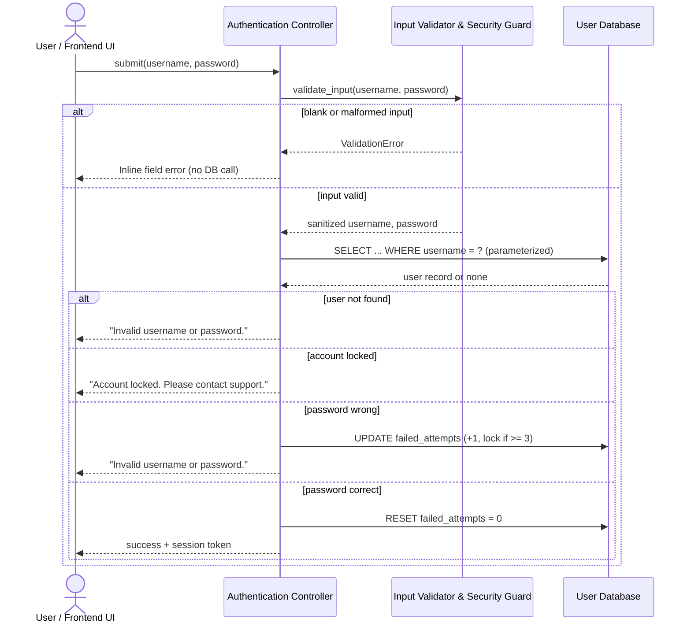
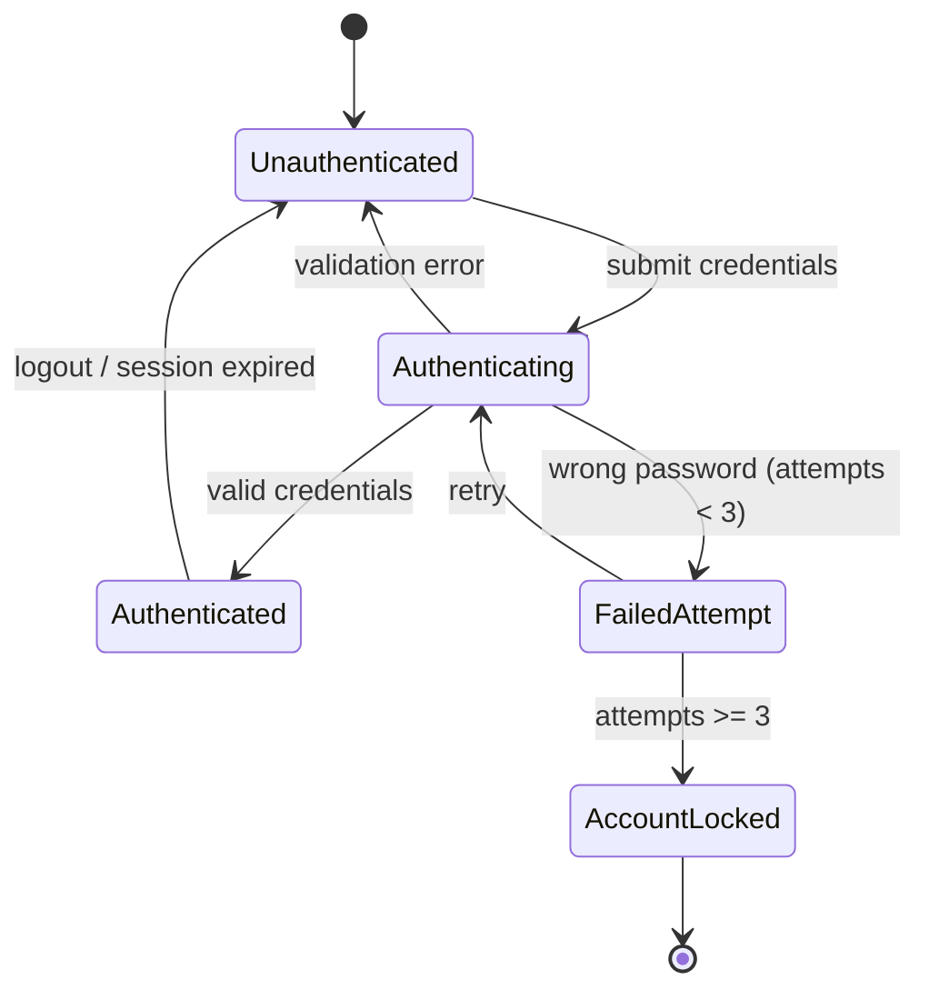

# UML Diagrams

## Sequence Diagram

```mermaid
sequenceDiagram
    actor U as User / Frontend UI
    participant C as Authentication Controller
    participant V as Input Validator & Security Guard
    participant D as User Database

    U->>C: submit(username, password)
    C->>V: validate_input(username, password)
    alt blank or malformed input
        V-->>C: ValidationError
        C-->>U: Inline field error (no DB call)
    else input valid
        V-->>C: sanitized username, password
        C->>D: SELECT ... WHERE username = ? (parameterized)
        D-->>C: user record or none
        alt user not found
            C-->>U: "Invalid username or password."
        else account locked
            C-->>U: "Account locked. Please contact support."
        else password wrong
            C->>D: UPDATE failed_attempts (+1, lock if >= 3)
            C-->>U: "Invalid username or password."
        else password correct
            C->>D: RESET failed_attempts = 0
            C-->>U: success + session token
        end
    end
```

## State Machine Diagram

```mermaid
stateDiagram-v2
    [*] --> Unauthenticated
    Unauthenticated --> Authenticating: submit credentials
    Authenticating --> Authenticated: valid credentials
    Authenticating --> FailedAttempt: wrong password (attempts < 3)
    FailedAttempt --> Authenticating: retry
    FailedAttempt --> AccountLocked: attempts >= 3
    Authenticating --> Unauthenticated: validation error
    Authenticated --> Unauthenticated: logout / session expired
    AccountLocked --> [*]
```
